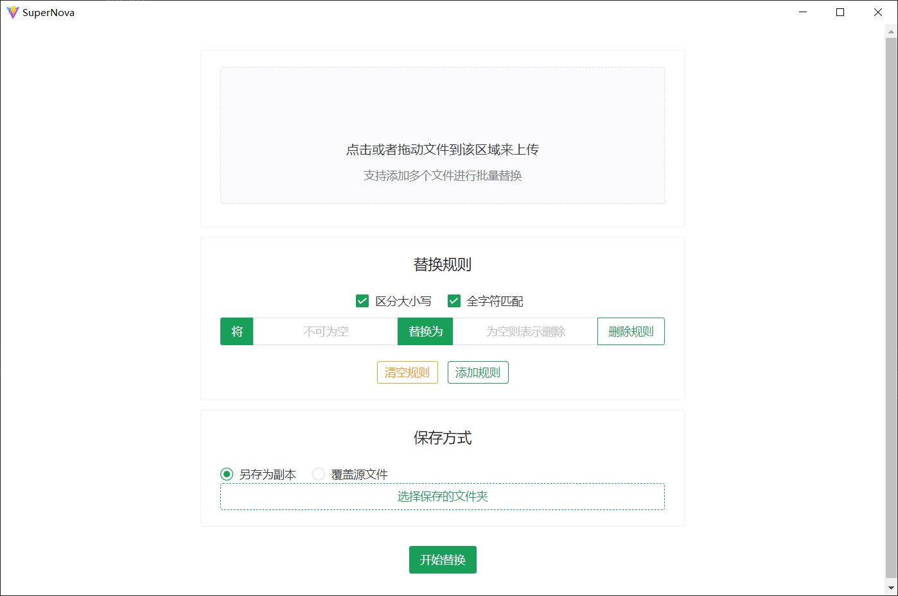

# super-nova

## 一个用于批量替换Word文档关键字的小工具，使用Electron + Vue 开发

```shell
npm install --registry=https://registry.npm.taobao.org --electron_mirror="https://npm.taobao.org/mirrors/electron/"
npm run dev
```

## 预览



